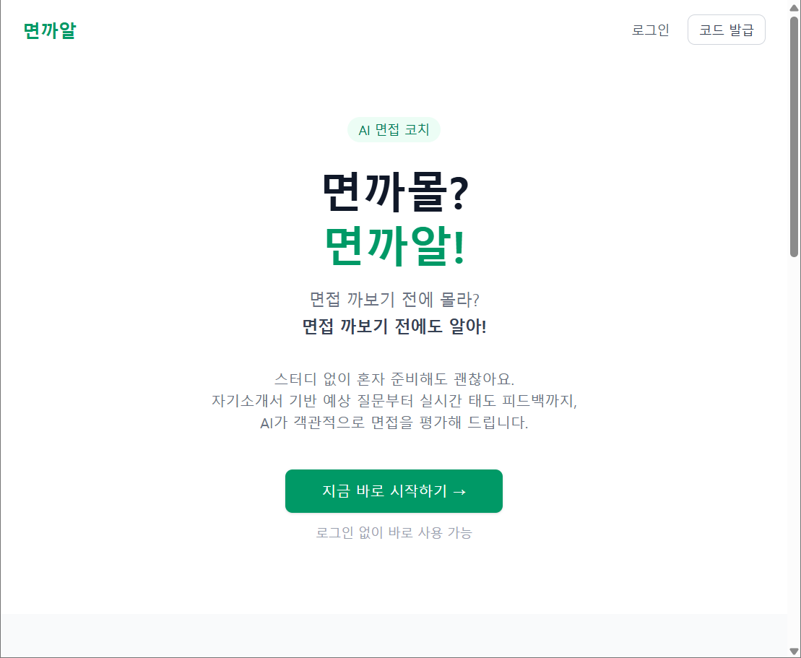
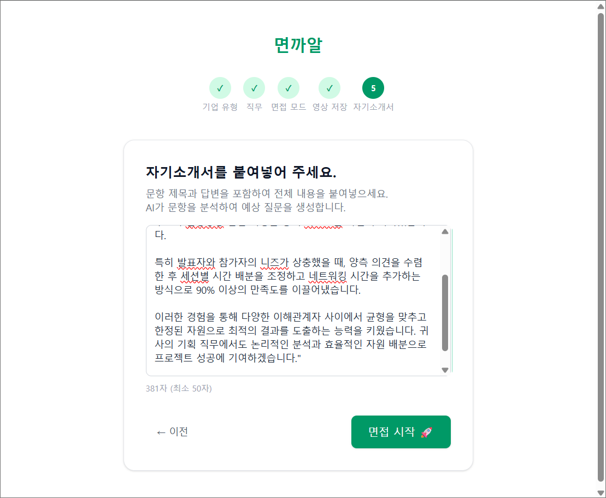
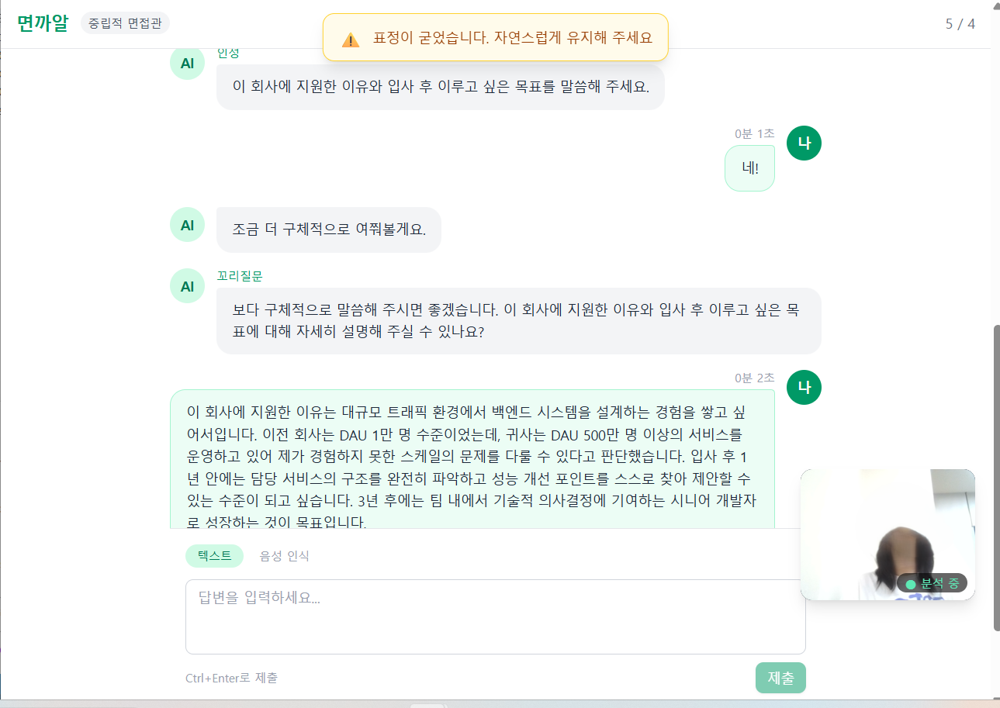
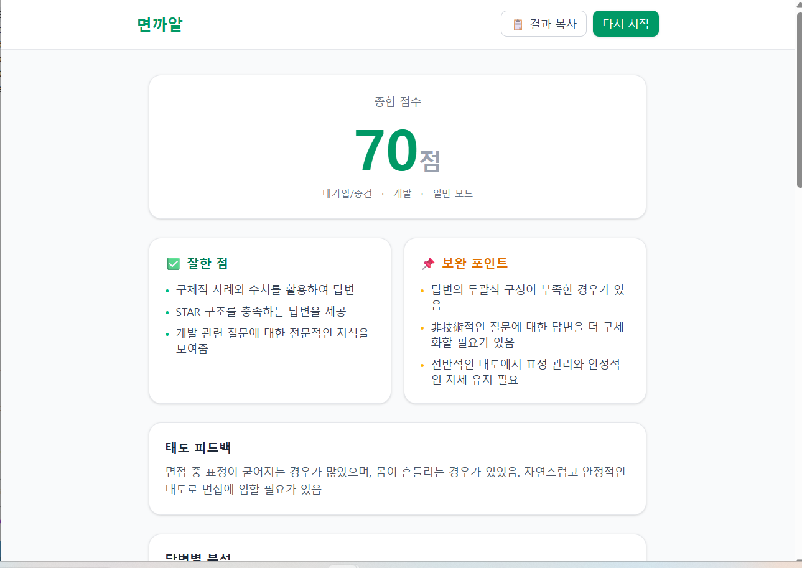
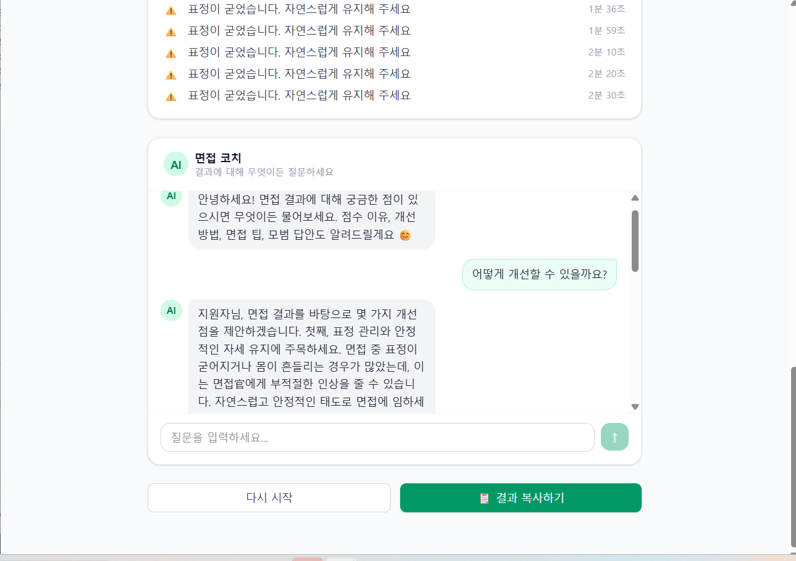

# 면까몰? 면까알!

> 면접 까보기 전에 몰라? **면접 까보기 전에도 알아!**
> 혼자 준비하는 사람을 위한 AI 모의 면접 서비스

---

## 스크린샷

| 온보딩 — 시작 화면 | 온보딩 — 정보 입력 |
|:---:|:---:|
|  |  |

| 면접 진행 | 결과 분석 |
|:---:|:---:|
|  |  |

<p align="center">
  
  <br/>
  <em>AI 면접 코치 채팅</em>
</p>

---

## 문제 정의

면접 준비의 가장 효과적인 방법은 실전처럼 반복 연습하고 피드백을 받는 것입니다.
하지만 스터디를 구하기 어렵거나, 내향적인 성격으로 타인 앞에서 연습하기 부담스러운 사람들은
**혼자 준비할 수밖에 없고, 자기 모습을 객관적으로 볼 수 없다**는 한계에 부딪힙니다.

면까알은 이 문제를 AI로 해결합니다.
자기소개서를 붙여넣는 것만으로 예상 질문부터 실시간 태도 분석, 종합 피드백, 코치 채팅까지
혼자서도 완전한 면접 준비를 할 수 있습니다.

---

## 핵심 기능

### 자기소개서 기반 맞춤 질문 생성
자기소개서 전체 텍스트를 입력하면 AI가 직접 분석하여 예상 질문을 생성합니다.
기업 유형(대기업·중견 / 스타트업)과 직무(개발·디자인·기획·마케팅·영업·인사)에 따라
인성 질문 풀이 달라지며, API 장애 시에는 직무별 예비 질문 풀로 자동 대체됩니다.

### 실전처럼 — 꼬리질문과 랜덤 면접관 어조
답변이 모호하거나 근거가 부족하다고 판단되면 AI가 꼬리질문을 자동 생성합니다.
면접관 어조는 **엄격 / 중립 / 친절** 중 랜덤 배정되어,
실제 면접에서 어떤 면접관을 만나도 대응할 수 있도록 설계했습니다.

### 실시간 태도 분석 (MediaPipe)
면접 중 브라우저에서 직접 행동을 분석하여 즉시 경고합니다:
- 시선 이탈 — 홍채 랜드마크 위치로 카메라 미응시 감지
- 과도한 움직임 — 어깨 미드포인트 프레임 간 이동량 추적
- 무표정 지속 — 입술·눈썹 간격 변화량으로 표정 감지
- 얼굴 미감지 — 3초 이상 카메라에서 벗어날 경우 경고

### AI 면접 코치 채팅
결과 화면에서 AI 코치와 자유롭게 대화할 수 있습니다.
코치는 해당 면접의 Q&A, 점수, 경고 기록 전체를 컨텍스트로 갖고 있어
"왜 점수가 이렇게 나왔어?", "모범 답안 알려줘" 같은 질문에 구체적으로 답변합니다.

### 프라이버시 우선 설계
- 영상은 서버에 전송되지 않고 브라우저 메모리에서만 처리
- 행동 분석도 MediaPipe를 브라우저 단에서 실행해 영상 데이터 외부 미전송
- 회원가입 없이 사용 가능, 8자리 랜덤 코드로 기록 열람

---

## 기술 스택 및 선택 이유

| 영역 | 기술 | 선택 이유 | trade-off |
|------|------|-----------|-----------|
| Frontend | React + TypeScript + Vite | 컴포넌트 단위 상태 관리, 타입 안정성 | Next.js 대비 SSR 없음 — SEO 불필요해서 SPA로 충분 |
| Styling | Tailwind CSS | 빠른 UI 프로토타이핑, 일관된 디자인 토큰 | 클래스가 길어져 가독성 저하; CSS-in-JS보다 런타임 오버헤드는 없음 |
| Backend | FastAPI (Python) | 비동기 지원으로 AI API 호출 지연 최소화 | Node.js 대비 생태계가 작지만 Gemini SDK 품질이 Python이 더 좋음 |
| Database | MySQL + SQLAlchemy | 관계형 데이터 구조에 적합, 로컬 환경 활용 | 트래픽이 커지면 ORM N+1이 문제될 수 있음; 현재 규모에서는 무방 |
| AI | Groq API (llama-3.3-70b-versatile) | 빠른 추론 속도, 무료 티어로 개발 가능 | API 장애 시 직무별 예비 질문 풀로 대체 |
| 음성 인식 | Web Speech API | 브라우저 내장 STT, 추가 설치 불필요 | Chrome 외 브라우저 지원 불안정; 오프라인 불가 |
| 행동 분석 | MediaPipe Tasks Vision | 브라우저 단 실행으로 영상 서버 전송 없음 | WASM 모델 파일이 커서 초기 로딩이 느림 (약 3~5초) |
| 영상 녹화 | MediaRecorder API | 브라우저 내장 API, 별도 라이브러리 불필요 | Safari 지원이 제한적; 현재 Chrome/Firefox 대상으로만 테스트 |

---

## 구현 과정에서의 주요 결정들

**꼬리질문 삽입 방식**
꼬리질문을 미리 생성하지 않고 답변 직후 AI가 실시간으로 판단하도록 했습니다.
질문 순서를 동적으로 조정하는 방식으로 구현해, 면접의 흐름을 자연스럽게 유지했습니다.
대신 API 응답 지연이 체감될 수 있어, 답변 제출 직후 타이핑 인디케이터를 먼저 보여줍니다.

**MediaPipe를 서버가 아닌 브라우저에서 실행**
영상을 서버로 전송하면 개인정보 문제가 생깁니다.
MediaPipe의 WebAssembly 빌드를 활용해 모든 분석을 클라이언트에서 처리하고,
경고 텍스트만 백엔드에 저장합니다.
초기 모델 로딩(~3~5초)이 느린 게 단점인데, 로딩 중에도 면접은 진행 가능하도록 했습니다.
추후 로딩 진행률 표시를 추가하면 UX가 개선될 것 같습니다.

**페이지 간 영상 전달 문제**
면접 페이지에서 녹화한 Blob을 결과 페이지로 넘길 때
React Router state로 직렬화가 불가능한 문제가 있었습니다.
모듈 레벨 싱글톤(`recordingStore`)을 만들어 같은 탭 세션 내에서 Blob URL을 유지하는 방식으로 해결했습니다.
탭을 새로 열거나 새로고침 하면 녹화본이 사라지는 한계가 있으나,
면접 직후 바로 다운로드하는 흐름이므로 현실적으로 문제가 없다고 판단했습니다.

**회원 시스템을 최소화한 이유**
이메일·비밀번호 방식은 개인정보 수집 부담이 있습니다.
8자리 랜덤 코드만으로 기록을 연결하는 방식을 택해,
수집 정보를 최소화하면서도 기록 열람 기능을 제공했습니다.
코드 분실 시 복구 불가라는 단점이 있지만, 서비스 특성상(익명 연습) 허용 가능한 trade-off라고 봤습니다.

---

## 서비스 흐름

```
온보딩 → 면접 진행 → 결과 분석 → 코치 채팅
  │           │            │
기업유형    실시간       종합점수
직무선택    행동분석     잘한점/보완점
모드선택    꼬리질문     답변별 피드백
자소서입력  타이머경고   태도 경고 기록
```

---

## 추후 개발 예정

- 아이패드 반응형 최적화
- 면접 시작 카운트다운 화면
- MediaPipe 모델 초기화 진행률 표시
- 모바일 지원
- AI 응답 한국어 순도 개선 — 간헐적으로 한자·영문이 섞이는 문제 발견
- 면접 부적절 행동 검출 확대 — 현재는 시선 이탈·과도한 움직임·무표정·얼굴 미감지만 잡고 있는데,
  머리카락 만지기, 턱 괴기, 자세 흐트러짐 등 면접에서 감점 요인이 되는 습관성 행동까지 감지 범위를 넓힐 예정

### 예외 처리 보강

현재 서비스의 에러 핸들링이 단순한 부분이 있어 보완 예정:

- **Groq API 에러 세분화** — 현재는 모든 API 실패를 동일하게 fallback 처리함. Rate limit(429), 네트워크 타임아웃, 잘못된 응답 형식을 구분해 재시도 로직 또는 사용자 안내를 다르게 제공해야 함
- **MediaPipe 초기화 실패 안내** — 현재 초기화 실패 시 콘솔 경고만 출력하고 면접은 그냥 진행됨. 사용자에게 "태도 분석 없이 진행됩니다"라는 명확한 안내 필요
- **세션 DB 저장 실패 처리** — 면접 도중 DB write 실패 시(예: 연결 끊김) 사용자가 작성한 답변이 유실될 수 있음. 중간 실패를 감지해 재시도하거나 로컬 임시 저장하는 방법 검토
- **AI 응답 JSON 파싱 실패** — Groq이 JSON 형식이 아닌 텍스트를 반환하면 `_parse_json()`이 예외를 던짐. 현재는 `None` 반환 후 fallback 질문 풀로 대체하는데, 빈 커버레터나 비정상 입력에 대한 사전 검증을 앞단에서 처리하면 더 안정적
- **프론트엔드 네트워크 에러 구분** — 현재 API 에러를 `e.message` 하나로 처리. 서버 500 오류, 네트워크 단절, 타임아웃을 각각 다른 메시지로 안내하면 UX 개선 가능

---

## 버그 수정 내역

### Windows 환경 AI 분석 오류 (2026-06-02)

**증상** — 면접 완료 후 결과 화면에서 종합 점수가 "분석 오류"로 표시되고 피드백이 생성되지 않음

**원인** — Windows 기본 터미널 인코딩(CP949)이 Groq API 응답에 포함된 특수 문자(→, • 등)를 처리하지 못해 `UnicodeEncodeError` 발생. 해당 예외가 `generate_final_feedback()`의 `except` 블록에서 조용히 잡히면서 에러 폴백 값이 DB에 저장됨

**수정 내용**
- `claude_service.py` — 원인이 된 `print(raw)` 제거
- `_parse_json()` — 정규식 기반으로 교체하여 AI 응답 앞뒤에 텍스트가 붙어도 JSON 추출 가능
- 에러 발생 시 로그 파일(`feedback_error.log`)에 기록하도록 개선

---

## 로컬 실행

개발 환경 세팅은 [SETUP.md](./SETUP.md)를 참고해 주세요.
